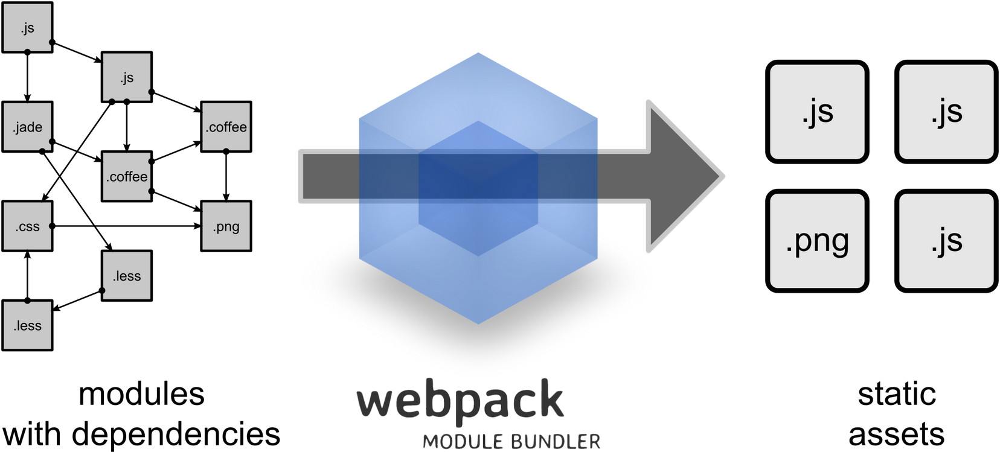

---

layout: ribbon

style: |

    #Cover h2 {
        margin:30px 0 0;
        color:#000;
        text-align:center;
        font-size:70px;
        }
    #Cover p {
        margin:10px 0 0;
        text-align:center;
        color:#FFF;
        font-style:italic;
        font-size:20px;
        }
        #Cover p a {
            color:#FFF;
            }
    #Picture h2 {
        color:#FFF;
        }
    #SeeMore h2 {
        font-size:100px
        }
    #SeeMore img {
        width:0.72em;
        height:0.72em;
        }
---

# {#Cover}

*Автор: [Давыденков Михаил](http://github.com/DavydenkovM/)*

## 5 способов управления ассетами в стандартных Rails приложениях

1. /vendor/assets - старый способ (/lib/assets тоже самое)
2. Использование готовых Ruby gems (например bootstrap)
3. С использованием Bower (через npm)
4. С использованием гема bower-rails gem
5. С использованием гема rails-assets.org (addinional gem source)

## Что в этих подходах плохого

1. /vendor/assets - как rails без бандлера, ручной режим, зависимости неуправляемы
2. готовые Ruby gems - на каждую либу гемов не наделаешь, с гемами бывают проблемы, гемы не сопровождаются
3. Bower уступает место npm и зачастую пакеты на него появляются с опозданием.
4. см п.3
5. rails-assets.org не успевает за развитием джаваскрипта.

## Мотивация

1. Пользоваться последними новшествами без лишних трудностей и посредников.
2. Использовать модули в JS и не зависеть от их форматов (будь то AMD, CommonJS, ES6 modules).
3. Использовать линтеры, лив-релоадинг, тесты и другие интересности на node.js.
4. Организовать архитектуру так как ты считаешь правильным с помощью модулей.
5. Использовать компонентный подход (Marionette modules -> CommonJS, Ember and components, Angular 2 and web-components).

## Webpack - module bundler. Преимущества

1. Уменьшает размер скомпилированных ассетов засчёт dependency resolving алгоритмов
2. Не зависит от формата модулей
3. Хорошо дружит с assets pipeline и может компилировать для неё один или несколько файлов
4. Может быть использован в development для LIVE RELOADING (как guard в рельсах для тестов)
5. Подходит для больших проектов, быстро запускается, cache-friendly
6. Развитая инфраструктура лоадеров и плагинов

##  [Продолжение презентации](http://peerigon.github.io/presentations/2014-07-09-MNUG-webpack/#1)
{:.shout #SeeMore}

##  [Пример интеграции с рельсой](https://github.com/DavydenkovM/NTP.git)
{:.shout #SeeMore}

