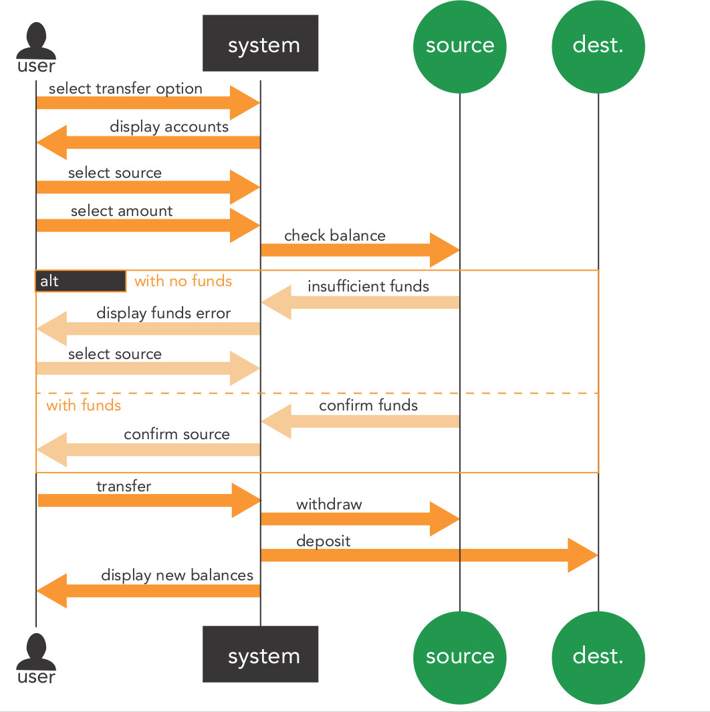

---

layout: ribbon

style: |

    #Cover h2 {
        margin:30px 0 0;
        color:#FFF;
        text-align:center;
        font-size:70px;
        }
    #Cover p {
        margin:10px 0 0;
        text-align:center;
        color:#FFF;
        font-style:italic;
        font-size:20px;
        }
        #Cover p a {
            color:#FFF;
            }
    #Picture h2 {
        color:#FFF;
        }
    #SeeMore h2 {
        font-size:100px
        }
    #SeeMore img {
        width:0.72em;
        height:0.72em;
        }
---

# Контекстный подход в Ruby on Rails приложениях {#Cover}

*Автор: [Давыденков Михаил](http://github.com/DavydenkovM/)*

<!-- photo by John Carey, fiftyfootshadows.net -->

## Предпосылки:

1. Парадигма MVC не предусматривает где живёт бизнес логика. Из-за этого бизнес логика имеет тенденцию размазываться по приложению.
2. Модели в классическом варианте нарушают принципы SRP и open/closed.
3. Код статичен, неясно как одни методы взаимодействуют с другими.
4. Тесты помогают понять, что происходит в приложении, однако они оторваны от кода и могут не отражать действительного функционирования программы

## Цели:

1. Инкапсулировать бизнес логику и отделить её от кода фреймворка (framework-agnostic code)
2. Сократить время понимания кода и упростить/ускорить процесс тестирования
3. Быстро понимать какие роли(actors) вовлечены в тот или иной контекст

## Основные положения Data Context Interaction подхода

1. Разделять стейт и поведение. Объект может заниматься ИЛИ хранением стейта(валидации, выборки из базы) ИЛИ управлять поведением(реализация алгоритмов)
2. Введение в приложение объектов типа объект-контекст
3. Представление бизнес-логики в виде сценариев
4. Использование Convention over Configuration принципов для организации бизнес-логики в коде

## Назначение контекст-объектов

1. Контекстные валидации
2. Назначение ролей экторам
3. Хранение алгоритмов, которые вызываются различными триггерами
4. Взаимодействие с другими контекстами (методами экторов)

## Структура контекст-объекта

~~~
Class MoneyTransfering
  # Блок инициализации c назначением ролей, 
  # Создание карты ролей(хэш ролей), 
  # Аксессоры, делегирование, валидации
  # Блок триггеров
  # Приватные методы
  # Модули/классы экторов
end
~~~

##  [Пример реализации контекстов в rails приложении](https://github.com/DavydenkovM/rails_contexts/)
{:.shout #SeeMore}

##  Картинка
{:.cover :Picture}

